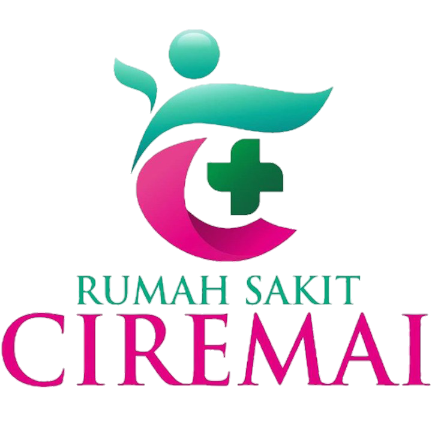

## About
___
Hello Everyone! I’m Kusino, a graduate of the Medical Records and Health Information Diploma from Poltekkes Kemenkes Tasikmalaya. I’ve had the opportunity to gain clinical experience at several healthcare facilities, including RS Sumber Waras, Puskesmas Palimanan, RSUD Prof. Dr. Margono Soekarjo, RSUP Dr. Hasan Sadikin Bandung, and RS Ciremai.

I specialize in collaborating with healthcare teams, managing time effectively, and ensuring accuracy in all tasks. My expertise includes electronic medical record management, health data analysis, coding (ICD), and maintaining strict patient confidentiality. Additionally, I’m proficient in utilizing hospital information systems (SIMRS), and I am eager to contribute as a dedicated and reliable Medical Records professional, fully committed to improving healthcare service quality.

I am open to new opportunities in healthcare service facilities. Feel free to contact me at kusino72@gmail.com for potential collaborations or job opportunities.

## Experience
___
 
<strong style="display: inline-block; margin-bottom: 0px;">Clinical Practice - Medical Records Departement</strong>  

  <em>Rumah Sakit Ciremai (Feb 2024 - Mar 2024)</em>   
  <em>Kota Cirebon, Jawa Barat, Indonesia</em>

**Clinical Practice - Medical Records Departement**  
*Rumah Sakit Umum Pusat Dr. Hasan Sadikin Bandung (Aug 2023 - Sep 2023)*  
*Bandung, Jawa Barat, Indonesia*  

**Clinical Practice - Medical Records Departement**  
*RSUD Prof. Dr. Margono Soekarjo (Mei 2023 - Mei 2023)*  
*Purwokerto, Jawa Tengah, Indonesia*

**Clinical Practice - Medical Records Departement**  
*Puskesmas Palimanan (Nov 2022 - Nov 2022)*  
*Cirebon, Jawa Barat, Indonesia*  

**Clinical Practice - Medical Records Departement**  
*Rumah Sakit Sumber Waras (Mar 2022 - Apr 2022)*  
*Cirebon, Jawa Barat, Indonesia*  

## Education
___
**Poltekkes Kemenkes Tasikmalaya**  
*A.Md.Kes - DIII - Rekam Medis dan Informasi Kesehatan*  
*IPK : 3,74*  
*2021 - 2024* 

Activities and Societies:  
I am currently pursuing a Diploma in Medical Records and Health Information, focusing on patient data management, medical coding (ICD-10), and the use of health information systems in healthcare settings. My courses provide comprehensive knowledge in:  
- Health data management and medical record storage
- Medical coding and classification (ICD-10)
- Hospital information systems (HIS) and electronic medical records (EHR)
- Legal and ethical aspects of health information

During my studies, I completed several internships in leading healthcare institutions, gaining hands-on experience in managing medical records, processing claims, and healthcare reporting. In addition, I am actively involved in community service activities where I take part in outreach activities in healthcare centers to improve the quality of medical record services and the efficiency of health information management.

