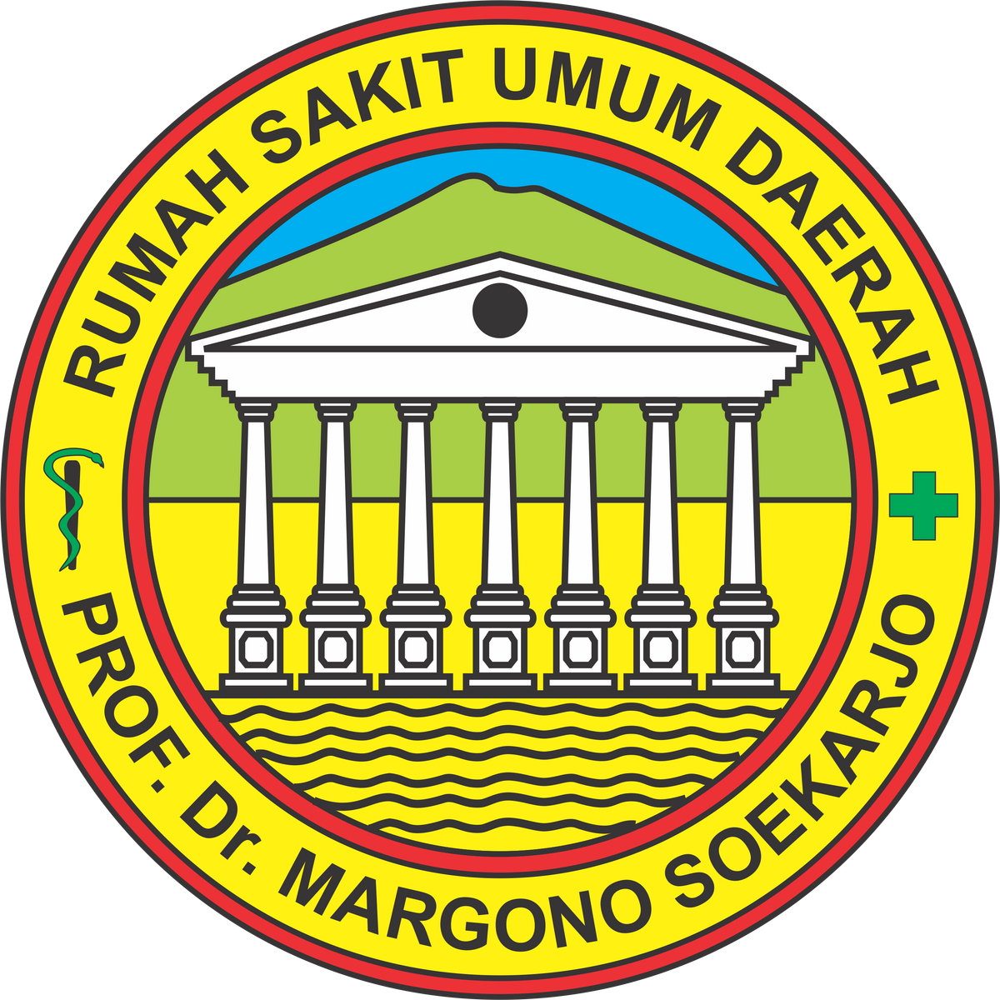
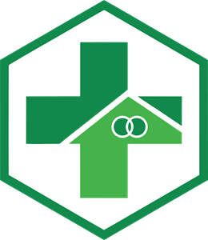
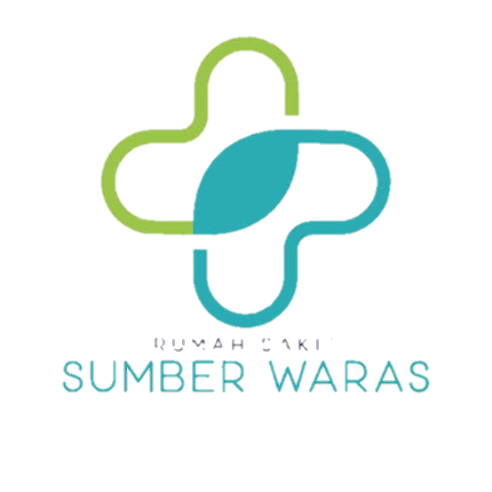
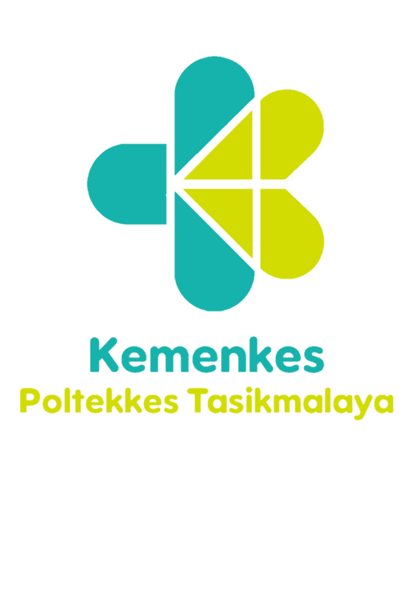

## About  

Hello Everyone! I’m Kusino, a graduate of the Medical Records and Health Information Diploma from Poltekkes Kemenkes Tasikmalaya. I’ve had the opportunity to gain clinical experience at several healthcare facilities, including RS Sumber Waras, Puskesmas Palimanan, RSUD Prof. Dr. Margono Soekarjo, RSUP Dr. Hasan Sadikin Bandung, and RS Ciremai.

I specialize in collaborating with healthcare teams, managing time effectively, and ensuring accuracy in all tasks. My expertise includes electronic medical record management, health data analysis, coding (ICD), and maintaining strict patient confidentiality. Additionally, I’m proficient in utilizing hospital information systems (SIMRS), and I am eager to contribute as a dedicated and reliable Medical Records professional, fully committed to improving healthcare service quality.

I am open to new opportunities in healthcare service facilities. Feel free to contact me at kusino72@gmail.com for potential collaborations or job opportunities.  

___

## Experience

  
  

    <strong>Clinical Practice - Medical Records Departement</strong> 
    <em>Rumah Sakit Ciremai (Feb 2024 - Mar 2024)</em> 
    <em>Kota Cirebon, Jawa Barat, Indonesia</em>
  

  
    

    <strong>Clinical Practice - Medical Records Departement</strong> 
    <em>Rumah Sakit Umum Pusat Dr. Hasan Sadikin Bandung (Aug 2023 - Sep 2023)</em> 
    <em>Bandung, Jawa Barat, Indonesia</em>
  

  
    

    <strong>Clinical Practice - Medical Records Departement</strong> 
    <em>RSUD Prof. Dr. Margono Soekarjo (Mei 2023 - Mei 2023)</em> 
    <em>Purwokerto, Jawa Tengah, Indonesia</em>
  

  
    

    <strong>Clinical Practice - Medical Records Departement</strong> 
    <em>Puskesmas Palimanan (Nov 2022 - Nov 2022)</em> 
    <em>Cirebon, Jawa Barat, Indonesia</em>
  

  
    

    <strong>Clinical Practice - Medical Records Departement</strong> 
    <em>Rumah Sakit Sumber Waras (Mar 2022 - Apr 2022)</em> 
    <em>Cirebon, Jawa Barat, Indonesia</em>
  

___

## Education

  
    

    <strong>Poltekkes Kemenkes tasikmalaya</strong> 
    <em>A.Md.Kes - DIII - Rekam Medis dan Informasi Kesehatan</em> 
    <em>IPK : 3,74</em> 
    <em>2021 - 2024</em>
  

Activities and Societies:  
I am currently pursuing a Diploma in Medical Records and Health Information, focusing on patient data management, medical coding (ICD-10), and the use of health information systems in healthcare settings. My courses provide comprehensive knowledge in:  
- Health data management and medical record storage
- Medical coding and classification (ICD-10)
- Hospital information systems (HIS) and electronic medical records (EHR)
- Legal and ethical aspects of health information

During my studies, I completed several internships in leading healthcare institutions, gaining hands-on experience in managing medical records, processing claims, and healthcare reporting. In addition, I am actively involved in community service activities where I take part in outreach activities in healthcare centers to improve the quality of medical record services and the efficiency of health information management.  

___

## Project & Publication

**[Hak Cipta APLIKASI E-VOTING PEMILIHAN KETUA HIMA PRODI DIII RMIK CIREBON POLTEKKES KEMENKES TASIKMALAYA](https://e-hakcipta.dgip.go.id/index.php/c?code=NzAwMGVhNjI2NTE1NzlmZjVkMzZkNzBmZGMwNWI1MDEK)**  
*published on: July 2024*  
Description :  
Aplikasi E-Voting merupakah aplikasi berbasis website yang dibuat dengan tujuan mempermudah proses pemilihan Ketua HIMA RMIK serta mempermudah dan mempercepat proses perhitungan hasil voting.

**[Indonesian Health Information Journal](https://ojs.poltekkes-malang.ac.id/index.php/JIKI/article/view/4430)**  
*Publication : Mei 2024*  
Description :  
Penelitian menganai pembuatan prototype sistem informasi posyandu berbasis web yang dibuat dengan tujuan agar dapat membantu proses dalam pelayanan pemantauan tumbuh kembang anak agar lebih efisien. Prototype Sistem Informasi Posyandu dibekali dengan fitur fitur unggulan seperti fitur pelayanan imunisasi, pelayanan penimbangan dan yang paling penting yaitu terdapat fitur KMS dan juga pemantauan tumbuh kembang dan stimulasi anak.  

**[Posyandu Information System](http://118.97.196.34:8070/sipandu)**  
*project : Apr 2024*  
Description :  
Sistem Informasi Posyandu merupakan sistem pelayanan posyandu berbasis website yang dapat digunakan untuk melakukan pencatatan terhadap pelayanan yang ada di posyandu seperti pelayanan imunisasi dan penimbangan, selain itu juga terdapat fitur unggulan yaitu fitur KMS online dan juga pemantauan tumbu kembang dan perkembangan stimulasi anak.  

**Community Service**  
*Puskesmas Jagasatru (Okt 2022)*  
Description :  
Pengabdian kepada masyarakat menjadi salah satu dari tri dharma perguruan tinggi yang rutin dilakukan oleh poltekkes kemenkes tasikmalaya dengan tujuan update informasi atau pemberian pelatihan kepada pemberi layanan medis seperti puskesmas dan sebagainya.  

___

## Languages  
**Bahasa Indonesia**  
*Native or bilingual proficiency*  

**Bahasa Inggris**  
*Limited working proficiency*  

___

## Social Media  

 

  

___

